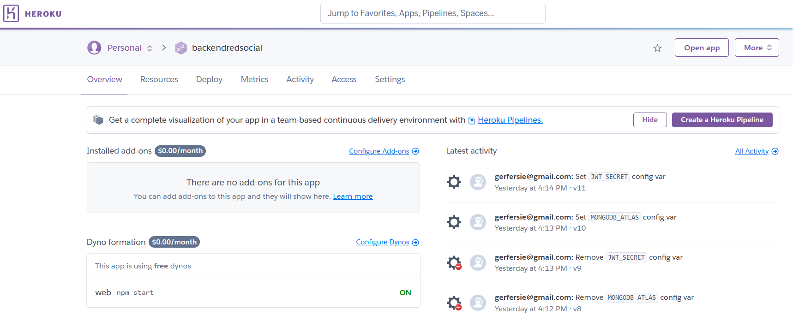
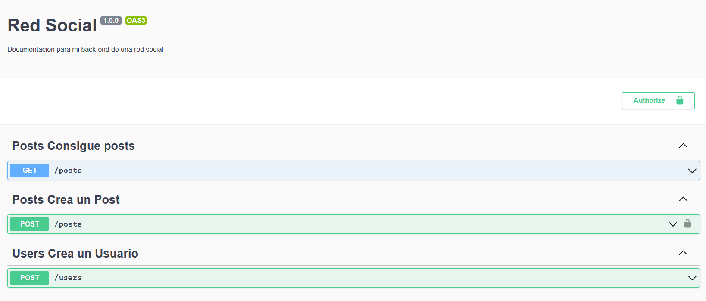
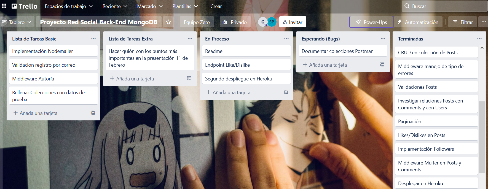

# Red Social

_Emularemos el comportamiento de una red social utilizando MongoDB, Mongoose y NodeJS_

## ¿Como desplegar el proyecto? 📋

Estas instrucciones te permitirán obtener una copia del proyecto en funcionamiento en tu máquina local para propósitos de desarrollo:

Clonarte el repositorio localmente:
> git clone url del repositorio

Instalar las depedencias necesarias:
> npm i

Rellenar las variables necesarias en estos archivos para iniciar el proyecto:

> - .env.example:
>   -  Puerto en el que quieras que se ejecute el server
>   -  Jwt_secret para la utilización de jsonwebtoken en la autenticación del usuario
>   -  Cadena de conexión con la base de datos en Mongo Atlas, MONGODB_ATLAS
>   -  Usuario y contraseña del servidor de correo utilizado en Nodemailer para el envio de correos

😊 Genial ya tenemos todo listo para poder llamar a los endpoints, ya podemos recibir y modificar datos 😊

## Endpoints y Middlewares🛠️

El sistema ataca a los 2 modelos de los que disponemos en la base de datos:

- Modelo User
    > Se puede registrar, loguear y desloguear un usuario (Con contraseña encriptada)
    > Podemos conseguir información de un usuario y también editarlo
    > Cada usuario puede tener followers y puede seguir a otros usuarios
    > Nuestro sistema aparte de la validación por correo, permite recuperar la contraseña en caso de olvido

- Modelo Post, este además cuenta con un array de comentarios dentro de él
    > Podemos hacer un CRUD completo de los Post 
    > Podemos hacer un CRUD completo de los comentarios
    > Se puede dar like y dislike tanto a posts como a comentarios

Se han utilizado middlewares para:

- Autenticación de usuarios
- Validación de errores en el registro de usuario y en la creación de posts
- Autoría a la hora de editar/eliminar posts y comentarios
- Subida de ficheros con imagenes para el campo de "image" de usuarios,posts y comentarios

## Despliegue en Heroku e implemetación de documentación con Swagger

Nuestro back-end se encuentra desplegado en Heroku:

 

Además hemos generado documentación de varios endpoints utilizando Swagger (También con autenticación):

 

## Tecnologías utilizadas 🚀

El proyecto ha sido desarrollado utilizando las siguientes paquetes en Nodejs:

* Expresss
* Nodemon
* Bcryptjs
* Jsonwebtoken
* Multer
* Dotenv
* Nodemailer
* Mongoose
* Swagger-ui-express
  
## 📌 Organización a la hora de trabajar en este proyecto 📌

El proyecto consta de dos ramas: main y develop, las distintas funcionalidades del proyecto se han implementado en distintas ramas que posteriormente se han fusionado con la rama develop que es la encargada de actualizar todo el trabajo de desarrollo. Finalmente cuando tengamos versiones estables de la rama develop la fusionamos con la rama main, la encargada de mostrar nuestro Back-End en producción.

Se han organizado las tareas siguiendo un tablero de trabajo de Trello:

 

---
Hecho por [Germán Fernández](https://github.com/GeerDev) 😊 
